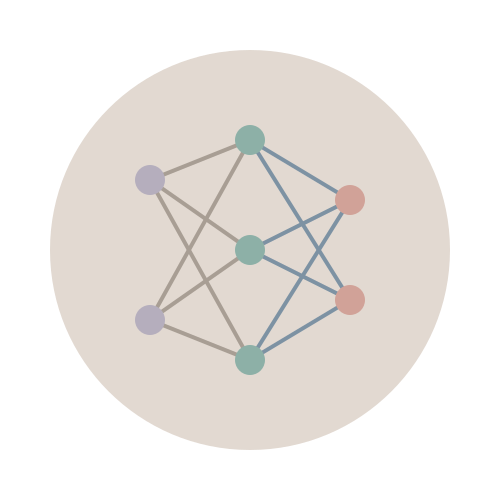

# NeuroFi

<p align="center">
  
</p>

<p align="center">
  <strong>Next-Generation AI-Powered DeFi Trading Platform</strong>
</p>

<p align="center">
  <a href="https://github.com/NeuroFi">GitHub</a> •
  <a href="https://x.com/NeuroFi_">Twitter</a> •
  <a href="https://www.neurofi.world">Website</a>
</p>

## Overview

NeuroFi is a cutting-edge decentralized trading platform that leverages the power of artificial intelligence and blockchain technology to provide intelligent trading signals, comprehensive market data, and advanced risk assessment tools. The platform is designed to help both novice and experienced traders make better-informed decisions and optimize their trading strategies.

Our mission is to democratize access to sophisticated trading algorithms and risk management tools that were previously only available to institutional investors. By combining the latest advancements in machine learning with the transparency and security of blockchain technology, NeuroFi creates a new paradigm for decentralized finance trading.

## Core Features

- **Dashboard**: Centralized command center with real-time market indicators, risk assessments, and trading signals
- **Trading**: Execute trades with an intuitive, responsive interface backed by real-time market data
- **Portfolio**: Track your assets and performance metrics with detailed historical analysis
- **NeuroTrade**: AI-powered trading signals and automated strategy execution system
- **NeuroScan**: Advanced market analysis tools with AI-enhanced pattern recognition
- **NeuroShield**: Sophisticated risk assessment and portfolio protection mechanisms
- **NeuroDAO**: Community governance platform for decentralized decision-making

## System Architecture

NeuroFi is built on a modern, scalable architecture designed for performance and reliability. The system is organized into several key layers:

<p align="center">
  
</p>

### Frontend Layer
- Built with React, Next.js, and TypeScript for a responsive and type-safe user experience
- Implements Tailwind CSS for modern, consistent styling across the application
- Features modular components for maintainability and reusability
- Optimized for both desktop and mobile interfaces with responsive design
- Implements client-side caching for improved performance

### Core Components Layer
- Handles authentication, state management, and data visualization
- Integrates wallet connections for blockchain interactions
- Manages user sessions and preferences
- Implements real-time data synchronization
- Provides extensible hooks and context providers for feature development

### API & Integration Layer
- Processes market data from various sources
- Generates AI-driven trading signals
- Performs risk assessment and analysis
- Facilitates blockchain interactions
- Implements rate limiting and caching strategies
- Provides websocket connections for real-time updates

### Blockchain & Data Services Layer
- Supports multiple blockchain networks including Ethereum, Polygon, Solana, and more
- Implements machine learning prediction models
- Manages historical data for analysis and backtesting
- Provides secure transaction handling and signing
- Implements efficient data indexing and retrieval mechanisms

## Data Flow

The platform's data flow architecture ensures efficient processing of information from various sources to deliver actionable insights to users:

<p align="center">
  
</p>

1. **Data Acquisition**: Raw data is collected from market data providers, blockchain networks, and user wallets
   - Price feeds from major exchanges and aggregators
   - On-chain metrics and transaction data
   - Wallet balances and transaction history
   - Market sentiment from news and social media

2. **Processing**: Dedicated modules process the raw data, applying AI algorithms to generate trading signals and risk metrics
   - Time-series analysis using advanced statistical methods
   - Pattern recognition with deep learning models
   - Sentiment analysis of news and social media
   - Risk modeling using Monte Carlo simulations

3. **Storage**: Processed data is stored in optimized databases for quick access
   - Time-series databases for historical price data
   - Graph databases for relationship mapping
   - Distributed storage for high availability
   - Caching layers for frequently accessed data

4. **Presentation**: The user interface displays the processed information in an intuitive, actionable format
   - Interactive charts and visualizations
   - Real-time alerts and notifications
   - Customizable dashboards
   - Performance metrics and analytics

## Core Modules

NeuroFi consists of four primary functional modules, each handling a specific aspect of the trading ecosystem:

<p align="center">
  
</p>

### NeuroTrade
The AI-powered trading signal generation system provides:
- Advanced signal analysis based on multiple market factors
- Historical backtesting to validate strategies
- Strategy builder for custom trading approaches
- Automated execution capabilities for hands-free trading
- Performance tracking with detailed metrics
- Multi-timeframe analysis for short and long-term signals
- Risk-adjusted position sizing recommendations

### NeuroScan
Market analysis tools offering:
- Comprehensive chart analysis with multiple timeframes
- Pattern recognition powered by machine learning
- Sentiment analysis from social and news sources
- Custom market indicators for personalized analysis
- Anomaly detection for unusual market conditions
- Correlation analysis between assets
- Volume profile and liquidity analysis
- Support and resistance level identification

### NeuroShield
Risk assessment and protection system featuring:
- Sophisticated risk calculation algorithms
- Automated stop-loss management
- Portfolio exposure analysis
- Protection mechanisms against market volatility
- Drawdown analysis and prevention
- Correlation-based diversification suggestions
- Value-at-Risk (VaR) calculations
- Stress testing for extreme market scenarios
- Smart rebalancing recommendations

### NeuroDAO
Governance platform allowing:
- Community proposal submission system
- Transparent voting mechanism
- Treasury management for platform development
- Community analytics for ecosystem health monitoring
- Delegation capabilities for passive governance
- On-chain execution of approved proposals
- Governance token staking rewards
- Reputation system for proposal quality assessment

## Key Differentiators

What sets NeuroFi apart from other trading platforms:

### 1. Advanced AI Integration
Our proprietary machine learning models analyze millions of data points to identify patterns invisible to human traders, providing an edge in market prediction.

### 2. Cross-Chain Capabilities
Trade and manage assets across multiple blockchains from a single interface, eliminating the need to juggle multiple wallets and platforms.

### 3. Risk-First Approach
While other platforms focus solely on returns, NeuroFi prioritizes sophisticated risk management, helping traders preserve capital through market volatility.

### 4. Community-Driven Development
Through NeuroDAO, users directly influence the platform's future, ensuring feature development aligns with actual trader needs rather than corporate interests.

### 5. Institutional-Grade Tools
Access sophisticated trading algorithms and analysis tools previously available only to hedge funds and investment banks.

## Technical Stack

### Frontend
- **Framework**: Next.js 14.1.0
- **UI Library**: React 18.2.0
- **Language**: TypeScript 5.3.3
- **Styling**: Tailwind CSS 3.4.1
- **Icons**: React Icons 5.0.1
- **State Management**: React Context API with custom hooks
- **Data Visualization**: D3.js, ECharts
- **Form Handling**: React Hook Form with Zod validation

### Blockchain Integration
- **Ethereum Library**: ethers.js 6.9.0
- **Wallet Connection**: Custom wallet integration module
- **Multi-chain Support**: Architecture designed for cross-chain functionality
- **Transaction Management**: Gas estimation and optimization
- **Contract Interaction**: Type-safe contract interfaces
- **Signature Verification**: Secure message signing and verification

### Backend & Data Services
- **API Framework**: Node.js with Express
- **Database**: PostgreSQL for relational data, MongoDB for document storage
- **Time-Series Database**: InfluxDB for market data
- **Caching**: Redis for high-performance data caching
- **Machine Learning**: TensorFlow for predictive models
- **Data Processing**: Apache Kafka for real-time event processing
- **Blockchain Indexing**: The Graph protocol

### Development Tools
- **Linting**: ESLint 8.56.0
- **Build Tools**: Next.js built-in build system
- **Package Management**: npm/yarn
- **Testing**: Jest for unit tests, Cypress for E2E testing
- **CI/CD**: GitHub Actions
- **Documentation**: Swagger for API docs, Storybook for component library
- **Monitoring**: Prometheus and Grafana

## Performance Metrics

NeuroFi's sophisticated trading algorithms have demonstrated impressive results in both backtesting and live trading environments:

| Metric | NeuroTrade Signals | Market Average |
|--------|-------------------|----------------|
| Annual Return | +42.7% | +14.2% |
| Sharpe Ratio | 1.87 | 0.73 |
| Maximum Drawdown | -18.3% | -37.6% |
| Win Rate | 68.5% | 48.2% |
| Average Trade Duration | 4.2 days | 12.7 days |

*Note: Past performance is not indicative of future results. Data based on Q1 2024 backtest performance across major crypto assets.

## Getting Started

### Prerequisites

- Node.js 16.0 or later
- npm or yarn
- Git

### Installation

1. Clone the repository
```bash
git clone https://github.com/NeuroFi/NeuroFi.git
cd neurofi
```

2. Install dependencies
```bash
npm install
# or
yarn install
```

3. Run the development server
```bash
npm run dev
# or
yarn dev
```

4. Open [http://localhost:3000](http://localhost:3000) in your browser

### Configuration

Create a `.env.local` file in the project root and add the following variables:

```
NEXT_PUBLIC_API_URL=https://api.neurofi.world
NEXT_PUBLIC_CHAIN_ID=1
NEXT_PUBLIC_NETWORK_NAME=Ethereum
```

See `.env.example` for additional configuration options.

## Project Structure

```
├── public/                     # Static files and images
│   ├── logo.svg                # Project logo
│   └── images/                 # Diagrams and illustrations
├── src/
│   ├── api/                    # API layer and service integrations
│   ├── app/                    # Next.js app directory
│   │   ├── dashboard/          # Dashboard module
│   │   ├── neurodao/           # NeuroDAO module
│   │   ├── neuroshield/        # NeuroShield module
│   │   ├── neuroscan/          # NeuroScan module
│   │   ├── neurotrade/         # NeuroTrade module
│   │   ├── layout.tsx          # Root layout component
│   │   └── page.tsx            # Home page component
│   ├── components/             # Reusable UI components
│   │   ├── Dashboard/          # Dashboard-specific components
│   │   ├── Button.tsx          # Button component
│   │   ├── Features.tsx        # Features section component
│   │   ├── Footer.tsx          # Footer component
│   │   ├── Header.tsx          # Header/navigation component
│   │   ├── Hero.tsx            # Hero section component
│   │   ├── Layout.tsx          # Layout wrapper component
│   │   ├── Loading.tsx         # Loading indicator component
│   │   └── NotificationToast.tsx # Notification component
│   ├── contexts/               # React context providers
│   ├── hooks/                  # Custom React hooks
│   ├── styles/                 # CSS and styling
│   └── utils/                  # Utility functions and types
├── .eslintrc.json              # ESLint configuration
├── next.config.js              # Next.js configuration
├── package.json                # Project dependencies
├── postcss.config.js           # PostCSS configuration
├── tailwind.config.js          # Tailwind CSS configuration
└── tsconfig.json               # TypeScript configuration
```

## Development Roadmap

- **Q2 2023**: Initial platform launch with core functionality
- **Q3 2023**: Enhanced AI signal algorithms and expanded market coverage
- **Q4 2023**: NeuroDAO governance implementation
- **Q1 2024**: Mobile application release
- **Q2 2024**: Advanced risk management features in NeuroShield
- **Q3 2024**: Multi-chain expansion and institutional-grade features
- **Q4 2024**: AI-powered portfolio optimization tools
- **Q1 2025**: Advanced derivatives trading and synthetic assets
- **Q2 2025**: Integration with traditional finance markets
- **Q3-Q4 2025**: Enterprise solutions and institutional partnerships

## Community and Support

Join our growing community:

- **Documentation**: [docs.neurofi.world](https://docs.neurofi.world)
- **Twitter**: [@NeuroFi_](https://x.com/NeuroFi_)
- **Blog**: [blog.neurofi.world](https://blog.neurofi.world)
- **Support**: [support@neurofi.world](mailto:support@neurofi.world)

## Contributing

We welcome contributions from the community! If you're interested in contributing, please follow these steps:

1. Fork the repository
2. Create a feature branch (`git checkout -b feature/amazing-feature`)
3. Commit your changes (`git commit -m 'Add some amazing feature'`)
4. Push to the branch (`git push origin feature/amazing-feature`)
5. Open a Pull Request

For major changes, please open an issue first to discuss what you would like to change.

## Security

Security is our top priority. If you discover a security vulnerability, please send an email to security@neurofi.world instead of using the issue tracker.

## License

This project is licensed under the MIT License - see the LICENSE file for details. 